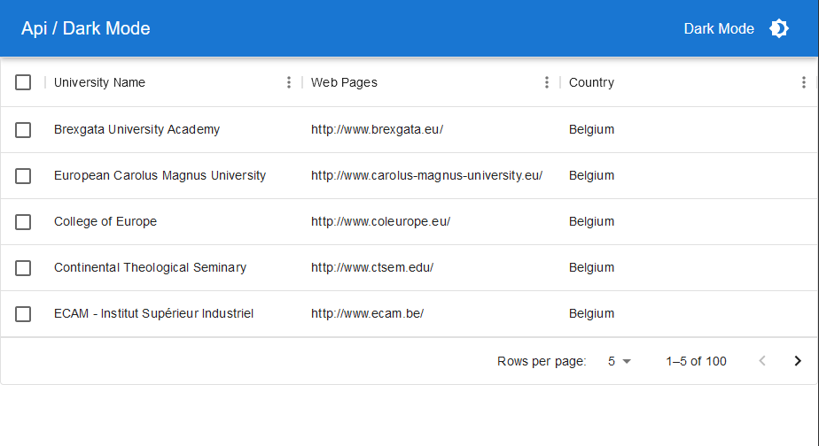
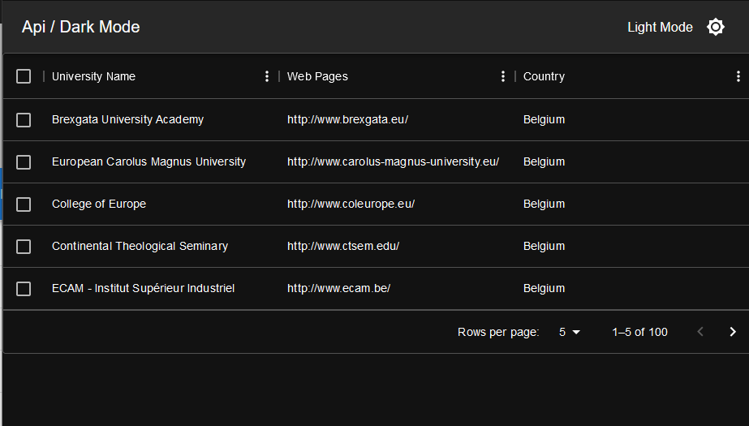

# MaterialUi_React

## Projet de Découverte de React et Material-UI

Ce projet vise à explorer les bases de React et à intégrer le framework Material-UI pour créer une application web simple. L'objectif principal est d'afficher un tableau alimenté par des données provenant d'une API, tout en offrant également un mode sombre à l'application.

## Fonctionnalités

- Affichage d'un tableau de données à partir de l'API des universités en Belgique.
- Utilisation de Material-UI pour concevoir l'interface utilisateur, garantissant un design élégant et réactif.
- Implémentation d'un mode sombre pour améliorer l'expérience utilisateur dans des environnements à faible luminosité.

## Captures d'écran

*Fig. 1 : Capture d'écran en mode clair de l'application affichant le tableau des universités.*

*Fig. 2 : Capture d'écran en mode sombre de l'application avec le tableau des universités et le mode sombre activé.*

## Installation

1. Clone ce dépôt : `git clone https://github.com/BillyGrind/MaterialUI_React/i`
2. Accède au répertoire du projet : `cd mui`
3. Installe les dépendances : `npm install`
4. Lance l'application : `npm start`

Assure-toi d'avoir Node.js et npm installés localement.

## Installation de Material-UI

1. Installe Material-UI : `npm install @mui/material @emotion/react @emotion/styled`
   
## Utilisation

1. Accède à l'application en ouvrant ton navigateur à l'adresse : `http://localhost:3000`
2. Le tableau des universités de Belgique sera affiché.
3. Utilise le commutateur de mode sombre pour basculer entre les modes clair et sombre.

## Technologies Utilisées

- React
- Material-UI
- CSS-in-JS (avec les styles spécifiques à Material-UI)
- API des universités : [http://universities.hipolabs.com/search?country=Belgium](http://universities.hipolabs.com/search?country=Belgium)

## Contributeurs

[@BillyGrind](https://github.com/BillyGrind)

N'hésite pas à contribuer en ouvrant des pull requests pour des améliorations, des corrections de bugs, etc.

